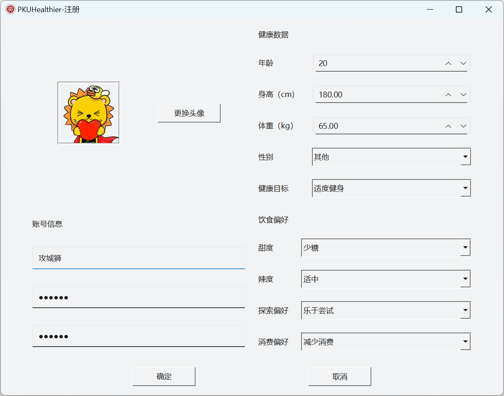
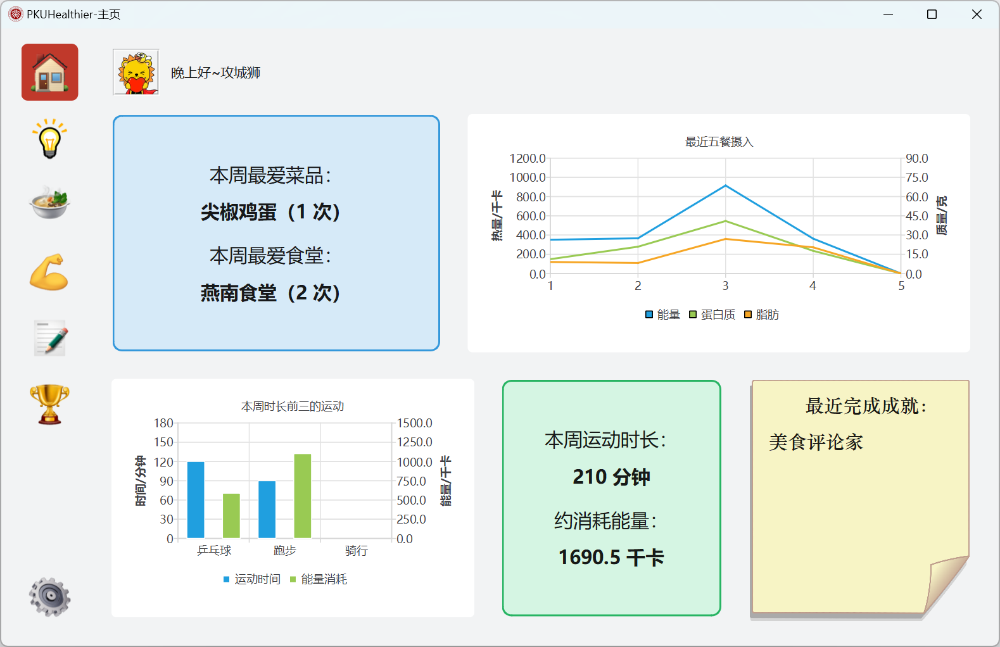
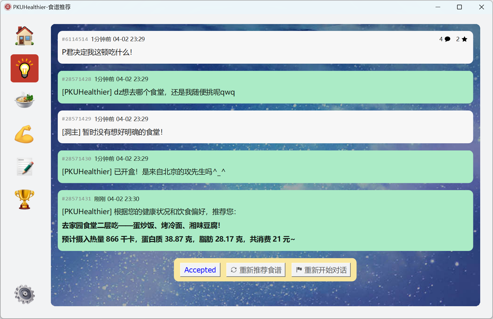
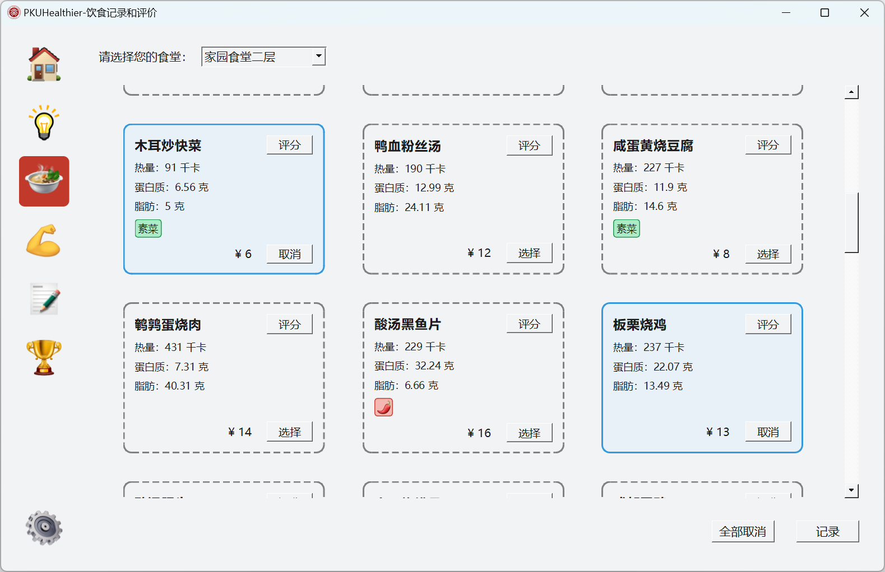
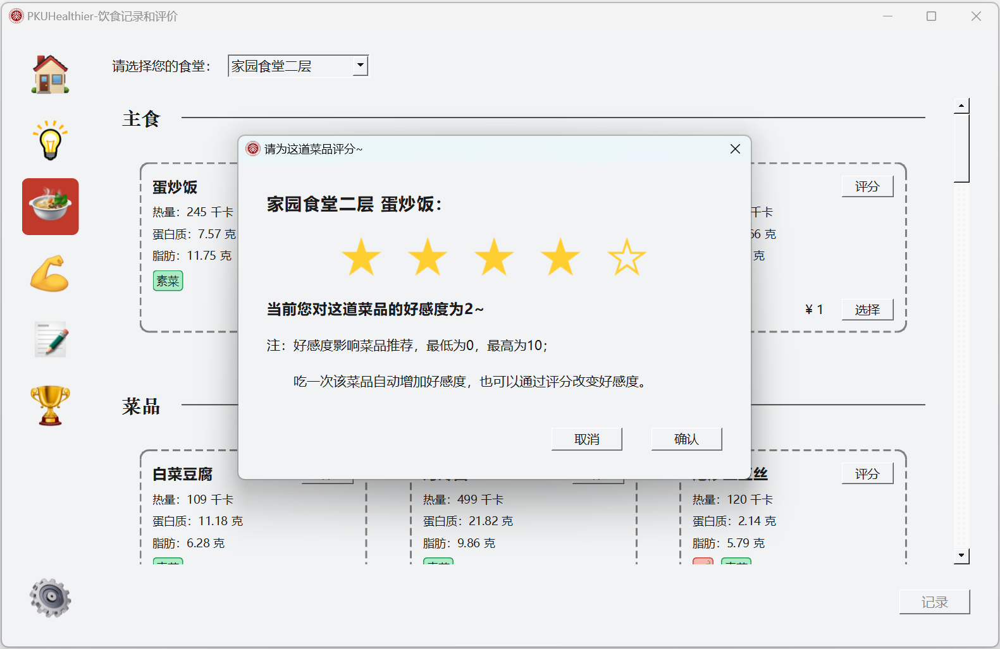
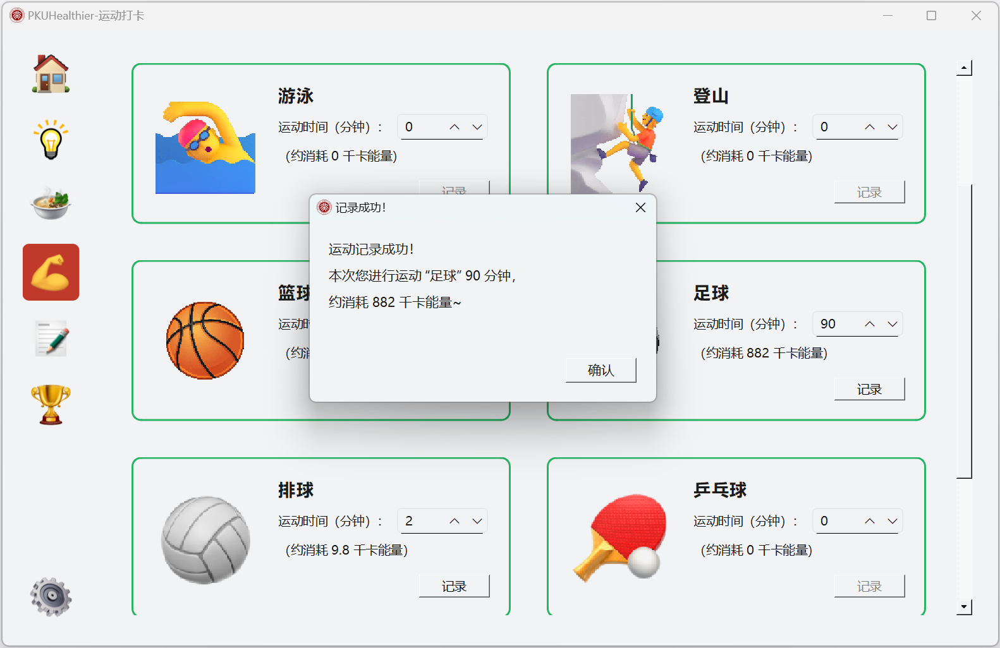
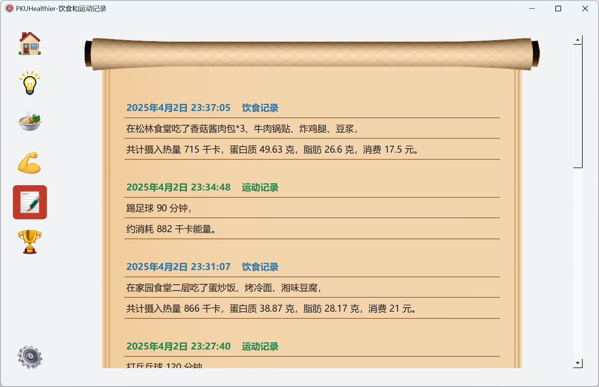
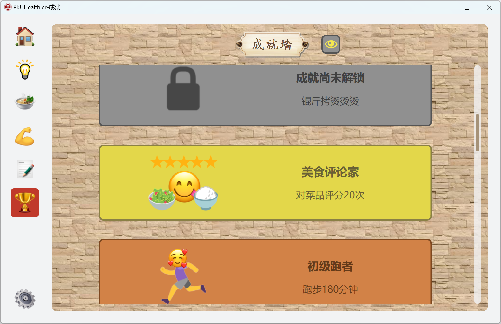
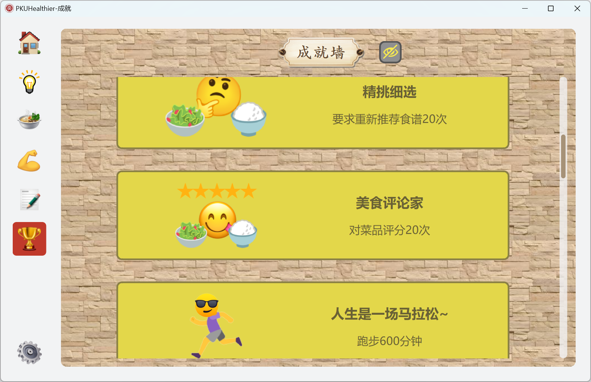

# PKUHealthier

### 更适合 PKUer 的健康管理程序

- 收集了燕园校区内大部分食堂的大部分菜品及其营养数据
- 根据用户的身体指标、饮食偏好等，个性化燕园食堂食谱推荐
- 菜品评价，好感度越高越容易被推荐
- 轻松记录饮食、运动数据，通过精美的图表使记录可视化
- 设计了有趣的隐藏成就，激励大家健康生活

> 致敬北大树洞的前身 PKU Helper

